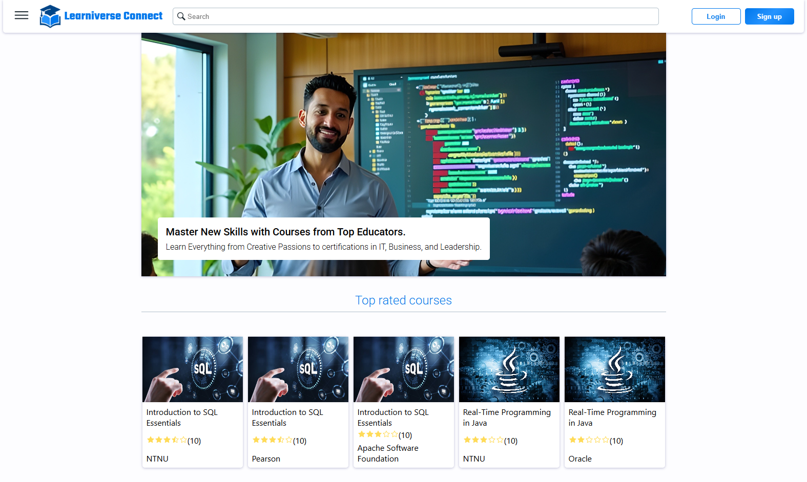
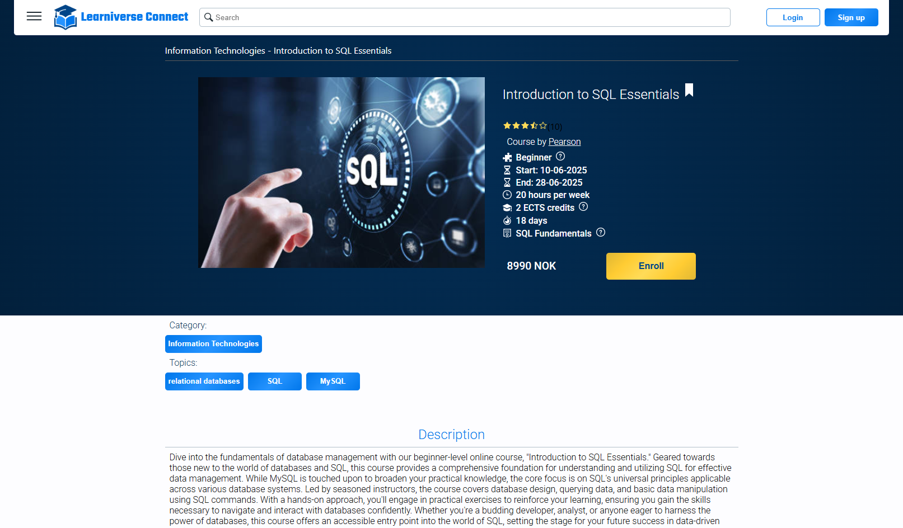
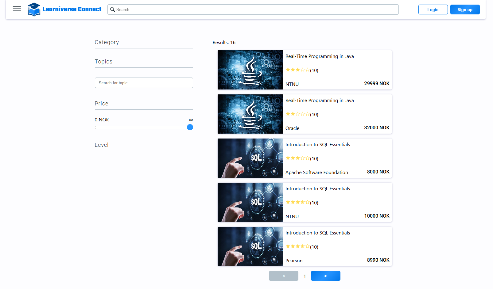
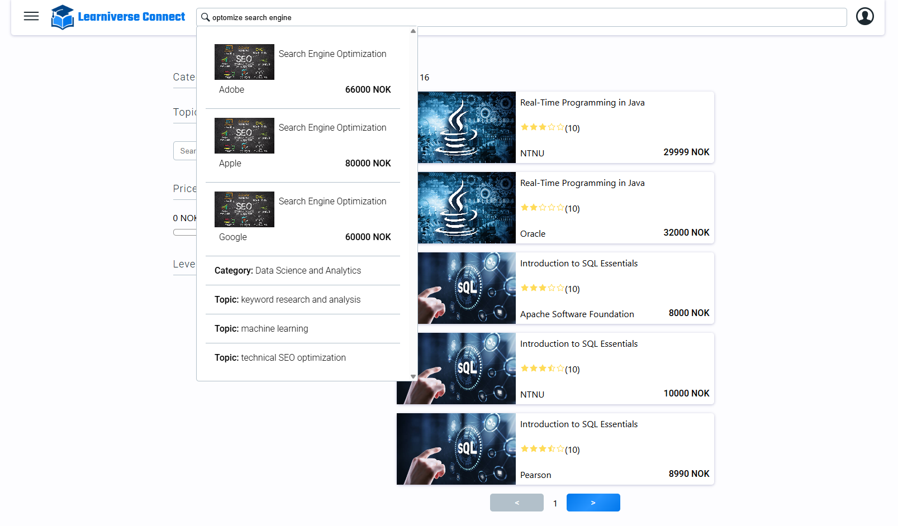
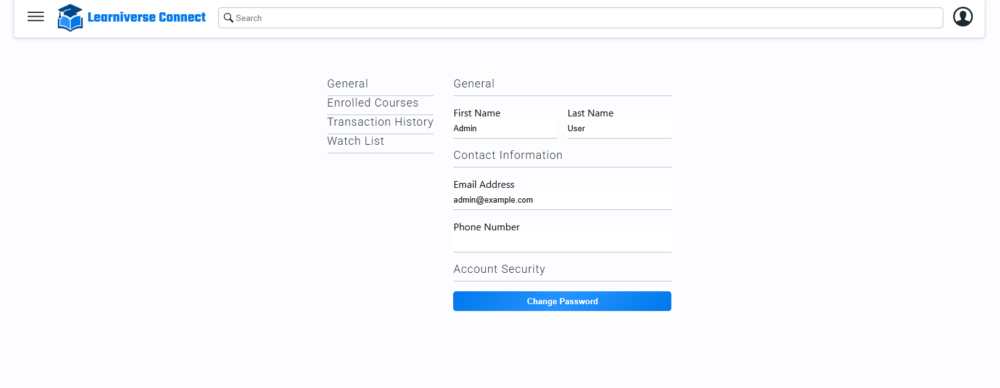
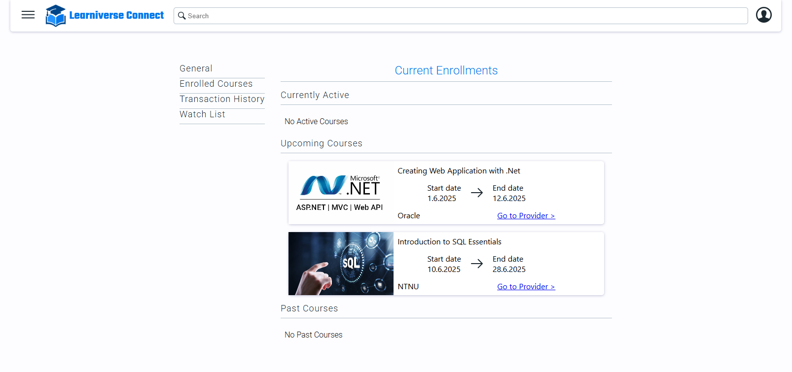
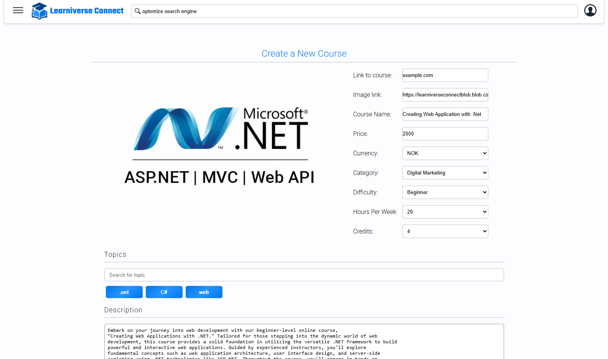
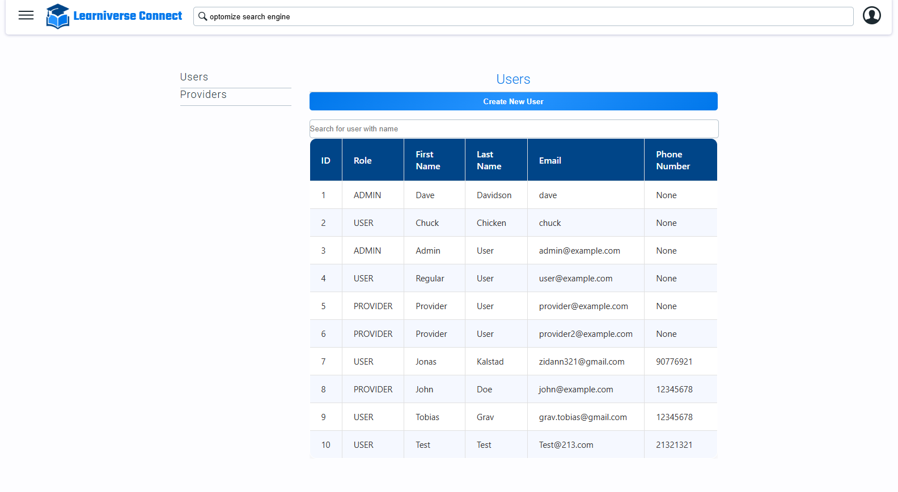

#  Learniverse Connect 
Learniverse Connect is an online learning platform that connects students with courses and educational providers. The platform allows users to browse, search, and enroll in various courses, as well as manage their learning journey.

Disclaimer: This website is a result of a university project for the courses IDATA2301 Web Technologies and IDATA2306 Application development at NTNU. All information presented is fictional. Any resemblance to real companies, products, or services is purely coincidental. All content is intended for non-commercial educational use.


## Table of Contents

- [Features](#features)
- [Design](#design)
- [Tech Stack](#tech-stack)
- [Prerequisites](#prerequisites)
- [Getting Started](#getting-started)
- [Environment Setup](#environment-setup)
- [Available Scripts](#available-scripts)
- [Default Users](#default-users)
- [Project Structure](#project-structure)
- [Deployment](#deployment)
- [Docker](#docker)

## Features

- **Course Discovery**: Browse and search for courses by various criteria
- **User Authentication**: Secure login and signup system
- **Course Enrollment**: Process to enroll and pay for courses
- **User Profiles**: Personal profiles with enrolled courses, watch lists, change password
- **Transaction History**: Users can view transaction history and receieve receipt email
- **Course Management**: For providers to create and manage courses
- **Administrative Tools**: User and provider management for administrators
- **Review Course**: User can review a course when enrolled and course is finished  
- **Responsive Design**: Works on mobile, tablet, and desktop devices


## Design

Design guidelines are outlined in the [DesignPage.html](./Documentation/Design/DesignPage.html) file, please consult the file for company colors and other instructions. 


- **Landing Page**:

- **Course Page**:

- **Search Page & Search in Header**:


- **My Profile Page**:

- **Enrollment Page**:

- **Provider Create Course Page**:

- **Admin User Page**:


## Tech Stack

- **Frontend Framework**: React 19.0.0
- **Routing**: React Router Dom 7.1.5
- **HTTP Client**: Axios
- **Authentication**: JWT (JSON Web Tokens)
- **Deployment**: Docker with Nginx
- **Cloud Infrastructure**: Microsoft Azure

## Prerequisites

To run this application, you need to have the following installed:

- Node.js
- Docker

## Getting Started

1. Install dependencies
   ```bash
   npm install --legacy-peer-deps
   ```

2. Start development server
   ```bash
   npm start
   ```

## Environment Setup

The application expects a backend API running at the URL specified in `src/utils/url.js`. By default, it points to:

```
https://learniverseconnect.norwayeast.cloudapp.azure.com
```

If you need to modify this for local development, update the URL in this file.

```
http://localhost:{backendport}
```

## Available Scripts

In the project directory, you can run:

### `npm start`

Runs the app in development mode. Open [http://localhost:3000](http://localhost:3000) to view it in your browser.


### `npm run build`

Builds the app for production to the `build` folder.

This removes the single build dependency and copies all configuration files into your project.

### Default Users

The application initializes with the following users:

- **Admin User**:
    - Email: `dave`
    - Password: `Dangerous2024`
    - Role: `ADMIN`

- **Regular User**:
    - Email: `chuck`
    - Password: `Nunchucks2024`
    - Role: `USER`

- **Additional Admin**:
    - Email: `admin@example.com`
    - Password: `adminpass`
    - Role: `ADMIN`

- **Additional User**:
    - Email: `user@example.com`
    - Password: `userpass`
    - Role: `USER`

- **Provider User**:
    - Email: `provider@example.com`
    - Password: `providerpass`
    - Role: `PROVIDER`

- **Additional Provider User**:
    - Email: `provider2@example.com`
    - Password: `providerpass`
    - Role: `PROVIDER`

## Project Structure

```
src/
├── App.css               # Main application styles
├── App.js                # Main application component with routing
├── index.css             # Global CSS styles
├── index.js              # Application entry point
├── components/           # Reusable UI components
│   ├── aboutUs/          # About us page components
│   ├── admin/            # Admin dashboard components
│   ├── common/           # Shared components (modals, tables, etc.)
│   ├── course/           # Course page components
│   ├── enroll/           # Enrollment flow components
│   ├── footer/           # Footer component
│   ├── header/           # Header component
│   ├── landing/          # Landing page components
│   ├── login/            # Login components
│   ├── myCourses/        # Course management for instructors
│   ├── myProfile/        # User profile components
│   ├── search/           # Search page components
│   ├── signup/           # Registration components
│   └── tos/              # Terms of service components
├── pages/                # Page folder
├── service/              # API service layer
│   ├── apiService.js     # Base API configuration
│   ├── courseService.js  # Course-related API calls
│   ├── enrollService.js  # Enrollment-related API calls
│   ├── providerService.js # Provider-related API calls
│   ├── searchService.js  # Search-related API calls
│   └── userService.js    # User-related API calls
└── utils/                # Utility functions
    ├── role.js           # Authentication and role management
    ├── ScrollToTop.js    # Scroll behavior management
    └── url.js            # API endpoint configuration
```

## Deployment

The application is configured to be deployed using Docker with Nginx. The provided Dockerfile builds the React application and serves it through Nginx.

### Building Docker Image

```bash
npm run build
docker build -t lc-frontend .
```

### Running Docker Container

The Docker container is dependent on a docker network, to create the network run:

```bash
docker network create lc-net
```
To run the frontend application in a Docker container, use the following command:

```bash
docker run -v /{PATH_TO_CERTIFICATE}:/etc/letsencrypt:ro --network lc-net -p 80:80 -p 443:443 lc-frontend:latest
```

**Note**: You need to generate a valid certificate for Nginx to work with HTTPS

## Docker

The application includes a Dockerfile that:

1. Uses Nginx as a base image
2. Copies the Nginx configuration
3. Copies the built React application
4. Exposes ports 80 and 443
5. Starts Nginx

---
